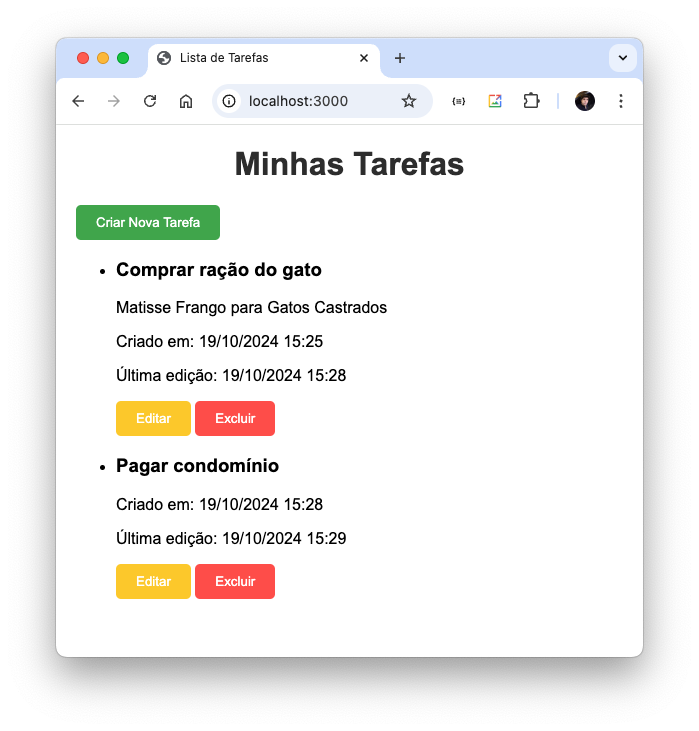

# T342-85 Téc de integração de sistemas - tarefa 01n Av2

_Professor Ronnison Reges Vidal_

Crie um banco de dados no SGBD mysql, chamado: mytask. A base de dados precisa ter uma tabela chamada: tarefa, com os seguintes campos: tarefa_id, titulo, descricao, data_criacao, data_finalizacao.

A partir disso o projeto deverá consistir de uma aplicação node em express que possui os segunites diretórios: database, public e views. Em public eu tenho um arquivo "styles.css", em database tenho um arquivo "connection.js" que cria conexões com um banco mysql. e na pasta views, tenho os arquivos: create.ejs, edit.ejs e index.ejs, que apresentam as telas de CRUD do projeto.

Na raiz da pasta deve haver o arquivo index.js que faz o processamento do servidor.



## Passos para reproduzir o projeto

1. **Clonar o repositório:**

   - Primeiro, clone o repositório para o seu ambiente local utilizando o comando:
     ```bash
     git clone git@github.com:carlosxfelipe/task-manager-unifor.git
     ```

2. **Instalar as dependências do projeto:**

   - Navegue para o diretório do projeto:
     ```bash
     cd task-manager-unifor
     ```
   - Instale as dependências do projeto utilizando o `npm`:
     ```bash
     npm install
     ```

3. **Configurar o banco de dados MySQL:**

   - Certifique-se de que o MySQL está instalado e em execução no seu sistema.
   - Conecte-se ao MySQL usando o terminal ou outro cliente MySQL e execute os seguintes comandos para criar o banco de dados e a tabela necessária:

     ```sql
     CREATE DATABASE mytask;

     USE mytask;

     CREATE TABLE tarefa (
         tarefa_id INT AUTO_INCREMENT PRIMARY KEY,
         titulo VARCHAR(255) NOT NULL,
         descricao TEXT,
         data_criacao DATETIME DEFAULT CURRENT_TIMESTAMP,
         data_finalizacao DATETIME
     );

     ALTER TABLE tarefa ADD data_edicao DATETIME DEFAULT CURRENT_TIMESTAMP ON UPDATE CURRENT_TIMESTAMP;
     ```

4. **Configurar a conexão com o banco de dados:**

   - Verifique o arquivo `connection.js` na pasta `database` e configure-o com as credenciais corretas para acessar o banco de dados MySQL (usuário, senha, e host, se necessário).

5. **Executar o servidor Node.js:**

   - Na raiz do projeto, inicie o servidor com o comando:
     ```bash
     node index.js
     ```

6. **Acessar a aplicação:**
   - Abra o navegador e acesse `http://localhost:3000` para interagir com a aplicação CRUD.
